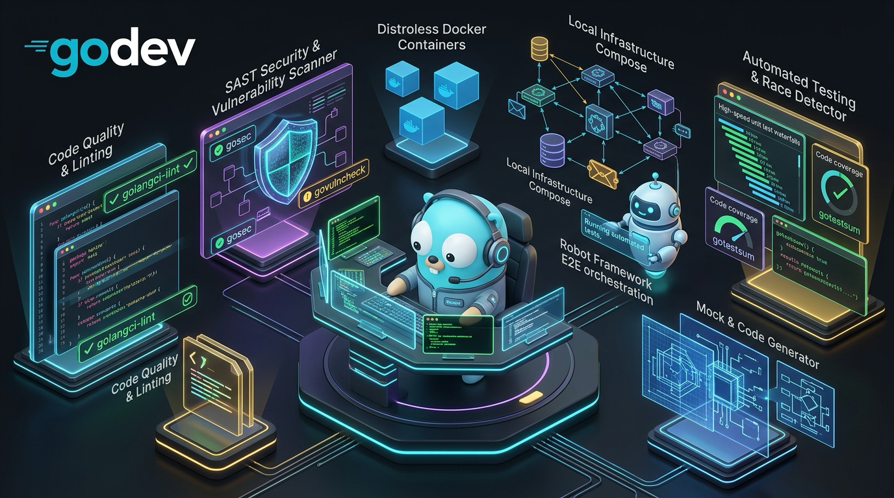

<p align="center">
  
</p>

# godev 🛠️

[](https://golang.org)
[](https://github.com/jmoyonero/godev/releases)
[](https://opensource.org/licenses/MIT)
[](https://github.com/jmoyonero/godev/actions/workflows/ci.yml)

> **A unified CLI for Go and microservice development.**  
> It standardizes code quality, SAST security analysis, known-vulnerability (CVE) checks, tests with race detection and coverage, code and mock generation, distroless Docker images, local infrastructure with Docker Compose and full E2E orchestration with Robot Framework.

---

## 🎯 Why `godev`?

When you have several Go microservices, copying and maintaining identical `Makefiles` or bash scripts leads to:
- **Massive duplication:** Bumping a linter version or a security rule means editing 10 repositories.
- **Inconsistencies between developers:** Commands that work on Linux or CI but fail on macOS because of differences in `lsof`, `kill` or Python paths.
- **Lack of standards:** Every microservice ends up with different flags and commands.

`godev` centralizes everything in a **single native Go binary**. Your microservices no longer need a `Makefile`, a `Dockerfile` or a `docker-compose.yaml` of their own.

---

## 🚀 Installation

### With `go install` (Recommended)
```bash
go install github.com/jmoyonero/godev@latest
```

Make sure `$GOPATH/bin` is on your `PATH`:
```bash
export PATH="$HOME/go/bin:$PATH"
```

### Requirements

- **Go 1.27+.** `golangci-lint` (at the `lint.version` version), `gosec` and `govulncheck` run through `go run`, with no manual install. `godev generate` uses the `mockgen` from `go.uber.org/mock` declared in the microservice's `go.mod`.
- **Docker** with Compose v2, for `infra`, `run`, `e2e` and `build-image`.
- **Python 3**, only for `e2e` (`godev` creates the virtualenv).
- **Optional:** [`gotestsum`](https://github.com/gotestyourself/gotestsum) for more readable test output (`go install gotest.tools/gotestsum@latest`).

---

## 📋 Available Commands

### 1. Quality, Linters and Security

| Command | Description |
| :--- | :--- |
| `godev verify [--skip-sec] [--skip-vuln]` | **Full pipeline:** runs `lint` + `sec` + `vulncheck` + `test` in sequence and prints a consolidated report with timings. |
| `godev lint [--fix]` | Runs `golangci-lint` at the version pinned in `lint.version` (the v2 line by default). Supports `--fix` for automatic fixes. |
| `godev sec` | SAST security analysis with `gosec`, excluding the directories in `sec.exclude_dirs` (generated code and mocks by default). |
| `godev vulncheck` | Scans dependencies for known vulnerabilities (CVEs) with `govulncheck`. |
| `godev test` | Runs the unit tests with `-race` and `-shuffle=on`. Uses `gotestsum` when installed and can produce a coverage report. |

`godev test` options:
```bash
godev test --path ./internal/...        # Packages to test (./... by default)
godev test --exclude-dir internal/it    # Excludes directories or packages (repeatable)
godev test --race=false --shuffle=off   # Disables the race detector or the random order
godev test --format testdox             # gotestsum format (testname, pkgname, dots, testdox...)
godev test --plain                      # Uses 'go test -v' even when gotestsum is installed
godev test --cover                      # Writes coverage.out and prints the total at the end
godev test --cover-profile cov.out      # Coverage profile file
godev test --html                       # Opens the HTML coverage report (implies --cover)
```

### 2. Code and Mock Generation

| Command | Description |
| :--- | :--- |
| `godev generate`<br>*(aliases: `gen`, `mocks`)* | Runs `go generate ./...` (e.g. OpenAPI with ogen) and uses `mockgen` to generate mocks for every interface in the module under `internal/mocks`. |

```bash
godev generate --mocks-only   # Mocks only, no 'go generate'
godev generate --skip-mocks   # 'go generate' only, no mocks
```

### 3. Docker Images

`godev` generates a multi-stage **universal Dockerfile**: it detects every binary under `cmd/` and creates one target per binary. Binaries are built statically and run on `gcr.io/distroless/static-debian12:nonroot` (no shell, non-root user).

| Command | Description |
| :--- | :--- |
| `godev dockerfile [-w]` | Prints the universal Dockerfile, or writes it to `./Dockerfile` with `-w`. |
| `godev build-image`<br>*(alias: `docker-build`)* | Builds the image locally with the embedded Dockerfile, without needing it in the repo. |

```bash
godev build-image -t scheduler                   # Target to build (api by default)
godev build-image -t api -i my-api:1.2.0         # Image tag (<target>:latest by default)
godev build-image --ssh-key ~/.ssh/deploy_key    # Key for private Go modules
godev build-image --no-cache                     # Builds without cache
```

For private modules, the SSH key is taken from `--ssh-key`, from `SSH_DEPLOY_KEY_B64` / `SSH_DEPLOY_KEY` or from `~/.ssh/id_ed25519` / `~/.ssh/id_rsa`. It is only used during `go mod download` and never ends up in the image.

### 4. Local Infrastructure (Docker Compose)

If the repo has no `docker-compose.yaml`, `godev` generates one on the fly with the services in `infra.services`:

| Service | Image | Default port |
| :--- | :--- | :--- |
| `db` | PostgreSQL 18 | `5432` |
| `wiremock` | WireMock 3 (mappings from `infra.wiremock_dir`) | `8090` |
| `jaeger` | Jaeger all-in-one | `16686` (UI) |
| `otel-collector` | OpenTelemetry Collector | `4317` (OTLP gRPC) |
| `prometheus` | Prometheus (enables `otel-collector`) | `9090` |
| `grafana` | Grafana with preloaded dashboards (enables `prometheus`) | `3000` |

`db`, `wiremock` and `jaeger` are started by default. If the repo already has a compose file (`compose_file`, `test/infra/`, `infra/`, `deployments/` or the root), that one is used.

> **One infrastructure at a time.** Every repo runs its infra under the same Compose project (`godev`). Bringing up one repo's infra destroys the previous one (whichever project it belonged to), volumes included, so there are never two stacks fighting over the same ports. The data is disposable: every run starts with a clean database.

| Command | Description |
| :--- | :--- |
| `godev infra up [services...]` | Destroys the previous infra, brings up this repo's in the background and waits until the services are ready (`pg_isready`, HTTP healthchecks). |
| `godev infra down [-v]` | Stops the containers (`-v` / `--volumes` also removes the volumes). |
| `godev infra reset-db` | Brings up the infra and applies the seed data script (`seeds.sql`). |
| `godev infra ps` | Shows the status of the containers. |

### 5. Running Services in Development (`godev run`)

| Command | Description |
| :--- | :--- |
| `godev run [services...]`<br>*(aliases: `start`, `dev`)* | **Concurrent development runner:**<br>1. Brings up the infrastructure (destroying any other project's).<br>2. Concurrently builds the services declared in `e2e.services` of `.godev.yaml` (or those passed as arguments, e.g. `godev run api`).<br>3. Frees busy ports by stopping the container that publishes them instead of blindly killing processes.<br>4. Injects the merged environment variables (`e2e.env` + `svc.env`).<br>5. Streams each service's logs with colored, aligned prefixes.<br>6. Actively waits for the healthchecks to respond OK.<br>7. Stops the processes cleanly on `Ctrl+C`. |

Options:
```bash
godev run             # Builds and starts every service
godev run api         # Starts only the 'api' service
godev run --reset-db  # Applies seeds.sql to the database before starting (-r)
```

### 6. End-to-End with Robot Framework

| Command | Description |
| :--- | :--- |
| `godev e2e` (or `godev robot`) | **Smart E2E orchestrator:**<br>1. Destroys the previous local infrastructure (whichever project it belonged to) and brings up this one's.<br>2. Restores the database with seeds if the repo defines them.<br>3. Creates and sets up the Python virtualenv (`.venv`) and installs `requirements.txt` if it does not exist.<br>4. Frees ports in use.<br>5. Builds and starts the required services in the background with their environment variables.<br>6. Waits with active healthcheck polling.<br>7. Runs Robot Framework.<br>8. Automatically opens the HTML report in Google Chrome.<br>9. Destroys containers, processes and binaries at the end, whether the tests pass or fail, or on Ctrl+C (except the containers with `--keep-infra`). |

Additional options:
```bash
godev e2e --no-browser    # Does not open the report in the browser
godev e2e --keep-infra    # Does not destroy the infrastructure at the end (to repeat runs)
godev e2e --suite path/   # Runs a specific suite
```

### 7. Configuration and Utilities

| Command | Description |
| :--- | :--- |
| `godev init [name]` | Generates a `.godev.yaml` configuration template in the current directory with every default value. |
| `godev version` | Shows the installed version of `godev`. |

---

## ⚙️ Configuration (`.godev.yaml`)

`godev` works with no prior configuration, applying sensible Go defaults. If a microservice needs to customize paths, ports or background services, it only needs a `.godev.yaml` (or `.godev.yml`) file. Every field is optional:

```yaml
name: loaney-api

infra:
  # compose_file: deployments/docker-compose.yaml  # Without it, one is generated on the fly
  services: [db, wiremock, jaeger]  # Add prometheus/grafana for observability
  seeds_file: test/seeds.sql
  wiremock_dir: test/wiremock
  db_service: db
  db_user: admin
  db_password: postgres
  db_name: loaney_db
  db_port: 5432
  wiremock_port: 8090
  prometheus_port: 9090
  grafana_port: 3000
  otel_port: 4317

lint:
  version: "v2.13.2"

sec:
  exclude_dirs:
    - "internal/oas"
    - "internal/mocks"

test:
  path: "./internal/..."
  exclude_dirs: []
  race: true
  shuffle: "on"
  format: testname           # gotestsum format
  cover: false               # true = --cover by default
  cover_profile: coverage.out

e2e:
  enabled: true
  type: robot
  venv_dir: test/robot/.venv
  requirements: test/robot/requirements.txt
  suite_dir: test/robot
  results_dir: test/robot/results
  open_report: true
  variables:
    API_BASE_URL: "http://127.0.0.1:8888"
    SCHEDULER_BASE_URL: "http://127.0.0.1:8080"
  env:
    CLOUDSQL_CONNECTION_NAME: "127.0.0.1"
    CLOUDSQL_CONNECTION_PORT: "5432"
    CLOUDSQL_DB: "loaney_db"
    CLOUDSQL_USER: "admin"
    CLOUDSQL_PASSWORD: "postgres"
    LOANEY_API_PROVIDER_BASE_URL: "http://127.0.0.1:8090"
  services:
    - name: api
      cmd: ./cmd/api
      port: 8888
      health_url: "http://127.0.0.1:8888/health"
      env:
        PORT: "8888"
    - name: scheduler
      cmd: ./cmd/scheduler
      port: 8080
      health_url: "http://127.0.0.1:8080/healthz"
      env:
        PORT: "8080"
```

The `seeds_file` and `wiremock_dir` paths are auto-detected when not set (`test/`, `test/infra/`, `infra/`, `deployments/` or the root).

---

## 👨‍💻 Author

Created and maintained by **Jonathan Moyonero** ([@jmoyonero](https://github.com/jmoyonero)).

## 📄 License

Distributed under the MIT License. See [LICENSE](LICENSE) for more information.
